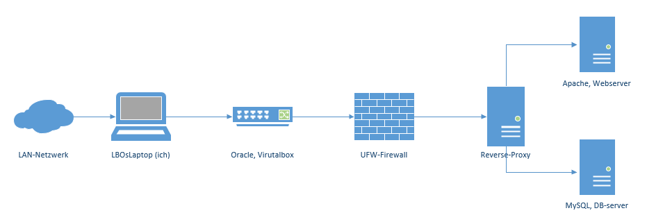
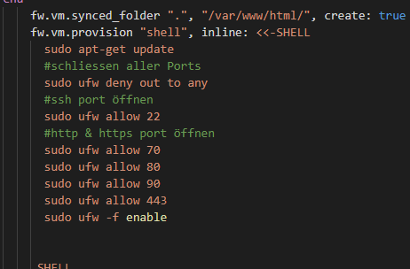
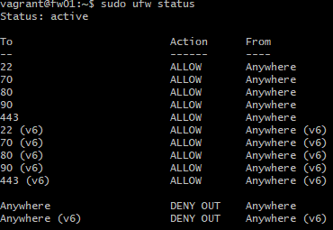
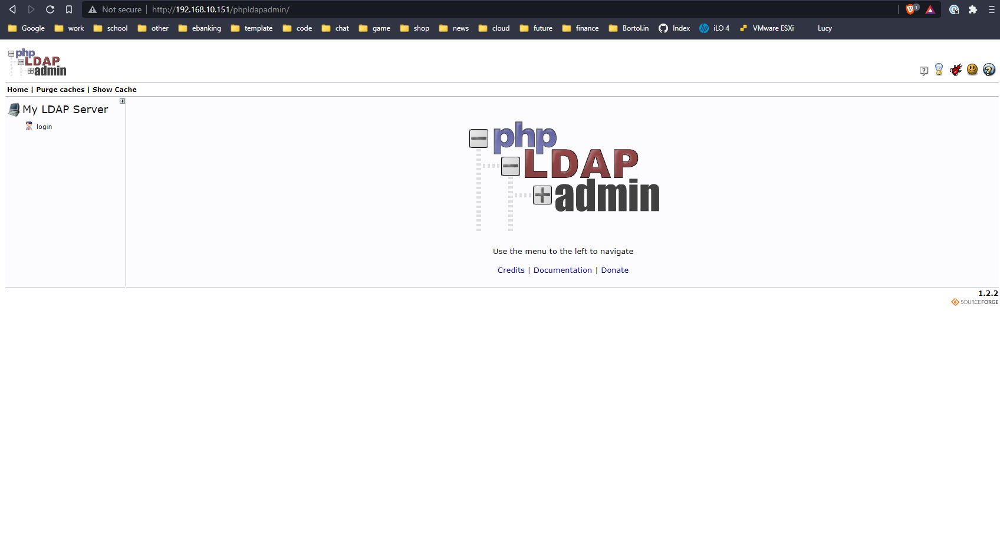
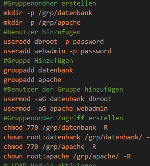
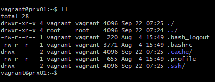

# M300 - Plattformübergreifende Dienste in ein Netzwerk integrieren

## LB2 Vagrantfile

Folgend erbringe ich meine Leistungsnachweise für die Lernbeurteilung 2 des Modul 300.

# Inhaltsverzeichnis
- [K1](#K1)
- [K2](#K2)
- [K3](K3)
- [K4](#K4)
- [K5](#K5)

## K1
Umbebung auf eigenem Notebook eingerichtet und funktionsfähig 
[1. VirtualBox](#1-virtualbox)  
[2. Vagrant](#2-vagrant) 
[3. Visualstudio-Code](#3-visualstudio-code) 
[4. Git-Client](#4-git-client) 
[5. SSH-Key für Client erstellen](#5-ssh-key-für-client-erstellen)

### 1. Virtualbox

Nach Anleitung des Lehrers installiert und ausgeführt.

Anleitung: https://github.com/mc-b/M300/tree/master/10-Toolumgebung

### 2. Vagrant

Nach Anleitung des Lehrers installiert und ausgeführt.

Anleitung: https://github.com/mc-b/M300/tree/master/10-Toolumgebung

### 3. Visualstudio-Code

Visualstudio-Code hatte ich bereits vorinstalliert, weshalb ich diesen Schritt überspringen konnte.

### 4. Git-Client

Nach Anleitung des Lehrers installiert und ausgeführt.

Anleitung: https://github.com/mc-b/M300/tree/master/10-Toolumgebung

### 5. SSH-Key für Client erstellen

Den SSh-Key habe ich ebenfalls bereits vorinstalliert, weshalb ich auch diesen Schritt überspringen konnte.

## K2
Eigene Lernumgebung (PLE) ist eingerichtet 
[1. GitHub oder Gitlab-Account ist erstellt](#1-github-oder-gitlab-account-ist-erstellt) 
[2. Git-Client wurde verwendet](#2-git-client-wurde-verwendet) 
[3. Dokumentation ist als Mark Down vorhanden](#3-dokumentation-ist-als-mark-down-vorhanden) 
[4. Mark down-Editor ausgewählt und eingerichtet](#4-mark-down-editor-ausgewählt-und-eingerichtet) 
[5. Persönlicher Wissenstand](#5-persönlicher-wissenstand) 
[6. Wichtige Lernschritte sind dokumentiert](#6-wichtige-lernschritte-sind-dokumentiert)

### 1. GitHub oder Gitlab-Account ist erstellt
GitHub Account: https://github.com/liviobortolin

Ich habe während dieser Arbeit Github-Desktop verwendet. Somit konnte ich alle commit, push, fetch und pull Befehle über ein UI erstellen.

### 2. Git-Client wurde verwendet

Wie vom Lehrer vorgeschlagen, nutze ich Git-Bash.

Anleitung: https://github.com/mc-b/M300/tree/master/20-Infrastruktur

### 3. Dokumentation ist als Mark Down vorhanden
Die Dokumentation ist in der README.md Datei.

### 4. Mark down-Editor ausgewählt und eingerichtet
Die README.md Datei habe ich mit GitHub Desktop jeweils im Visualstudio geöffnet und editiert.

### 5. Persönlicher Wissenstand

Anbei dokumentiere ich meinen Wissenstand und definiere meinen Fortschritt.

#### Tag 1 25.08.21
Der Fokus des heutigen Tages ist die initialisierung des Modul. Heute habe ich meine Arbeitsstation aufgebaut. Dies beinhaltete, dass ich Virtualbox, GIThub-Desktop, Visualstudio und Vagrant installiert und konfigurierte. 

Ich lernte Vagrant kennen, da ich dass bislang noch nie damit gearbeitet habe. Somit konnte ich viel neues lernen. Automationist ein Schwerpunkt in der IT, welcher mich sehr interessiert. Somit kann ich auch persöhnlich viel von diesem Modul profitieren.

zusätzlicher Wissenstand in folgenden Schwerpunkten: 

##### Linux
-Wissen in Linux -> Pfad editieren, manipulieren, navigieren und kreiren hatte ich bereits vor dem Modul 
##### Virtualisierung
-Grundprinzip war mir klar wie Virtualisierung funktionierte (UeK-340)
##### Vagrant
-Vagrant neu kennengelernt
-Vagrantfile erstellt und editiert
-Vagrant init/up/destroy -f
##### Git
-Git Repository erstellt
-README.md file erstellt und editiert

#### Tag 2 08.09.2021
Heute habe ich an meinem Vagrant file weiter gearbeitet. Ich bin mitlerweile so weit, dass ich mehrere VMs erstellt habe. Auf diese VMs kann ich mittels localhost zugreiffen. Jenach VM die ich erstellt habe, habe ich eine Portweiterleitung erstellt.

Ich habe die Dokumentation erweitert und besser Strukturiert. Somit muss ich nur noch gewisse Skripts einfügen und testen, um sie anschliessend zu beschreiben.

Ich lernte mehr über Vagrant kennen und fühle mich sicherer, diese files zu editieren. Es kommt jedoch immernoch zu komplikationen, was mich zu einem zusätzlichen Termin veranlasst, nochmals an diesem Projekt zu arbeiten.

Nun da ich fertig bin, kann ich mein Vagrantfile abgebgen.

##### Linux
-f überall wo notwendig, anwenden
##### Virtualisierung
-nichts neues
##### Vagrant
-destroy Verhalten
##### Git
-nichts neues

#### Tag 3 22.09.2021
Ich habe heute an meinem Vagrant file weiter gearbeitet. Nun da ich mehere VMs erstellen kann, will ich diese möglichst gut konfigurieren, so dass ich auf diese Zugreiffen kann. Im besten fall über Web.

In der Dokumentation fehlen nur noch die folgenden Tage, an denen ich noch am Vagrantfile arbeiten werde.
Zudem muss ich noch meine Sktipts innerhalb dieser Dokumentation beschreiben und die Testfälle erstellen.

Je mehr ich über Vagrant lerne, desto einfacher fählt es mir gewisse VM zu strukturieren.
Ich habe immernoch schwierigkeiten mit gewissen Fehlermeldungen, diese werde ich jedoch in den nächsten paar male korrigieren.

##### Linux
-Directory orientierung
##### Virtualisierung
-anlegen von Verzeichnissen und diese editieren
##### Vagrant
-innerhalb einer VM ein Index.html file ändern
##### Git
-nichts neues

### 6. Wichtige Lernschritte sind dokumentiert

Ich glaube, ich habe die meisten meiner Lernschritte im Markup festgehalten. Ich werde hier jedoch noch einiges besprechen. Zuerst hatten wir Zeit, uns mit der Vagrant-Umgebung vertraut zu machen und grundlegende Befehle auszuprobieren, was uns sehr geholfen hat. Auch die Fehlersuche hat mir sehr geholfen und ich habe viel daraus gelernt. Tatsächlich beinhaltet das gesamte Projekt nur Lernschritte, und es fällt mir schwer, hier das Wichtigste zusammenzufassen.

## K3
[1. Bestehende vm aus Vagrant-Cloud einrichten](#1-bestehende-vm-aus-vagrant-cloud-einrichten) 
[2. Kennt die Vagrant-Befehle](#2-kennt-die-vagrant-befehle) 
[3. Eingerichtete Umgebung ist dokumentiert](#3-eingerichtete-umgebung-ist-dokumentiert) 
[4. Funktionsweise getestet inkl. Dokumentation der Testfälle](#4-funktionsweise-getestet-inkl-dokumentation-der-testfälle) 
[5. Andere, vorgefertigte vm auf eigenem Notebook aufgesetzt](#5-andere-vorgefertigte-vm-auf-eigenem-notebook-aufgesetzt)

### 1. Bestehende vm aus Vagrant-Cloud einrichten

vagrant up

### 2. Kennt die Vagrant-Befehle

Usage: vagrant [optionen] <Befehl> [<args>]

Mit dem Befehl "vagrant list-commands" werden alle Befehle aufgeführt:

|Befehl          |Bedeutung
|:---------------|:---------------------------------------------------------------|
|autocomplete    |manages autocomplete installation on host                       |
|box             |manages boxes: installation, removal, etc.                      |
|cap             |checks and executes capability                                  |
|cloud           |manages everything related to Vagrant Cloud
|destroy         |stops and deletes all traces of the vagrant machine
|docker-exec     |attach to an already-running docker container
|docker-logs     |outputs the logs from the Docker container
|docker-run      |run a one-off command in the context of a container
|global-status   |outputs status Vagrant environments for this user
|halt            |stops the vagrant machine
|help            |shows the help for a subcommand
|init            |initializes a new Vagrant environment by creating a Vagrantfile
|list-commands   |outputs all available Vagrant subcommands, even non-primary ones
|login           |
|package         |packages a running vagrant environment into a box
|plugin          |manages plugins: install, uninstall, update, etc.
|port            |displays information about guest port mappings
|powershell      |connects to machine via powershell remoting
|provider        |show provider for this environment
|provision       |provisions the vagrant machine 
|rdp             |connects to machine via RDP
|reload          |restarts vagrant machine, loads new Vagrantfile configuration
|resume          |resume a suspended vagrant machine
|rsync           |syncs rsync synced folders to remote machine
|rsync-auto      |syncs rsync synced folders automatically when files change
|snapshot        |manages snapshots: saving, restoring, etc.
|ssh             |connects to machine via SSH
|ssh-config      |outputs OpenSSH valid configuration to connect to the machine
|status          |outputs status of the vagrant machine
|suspend         |suspends the machine
|up              |starts and provisions the vagrant environment
|upload          |upload to machine via communicator
|validate        |validates the Vagrantfile
|version         |prints current and latest Vagrant version
|winrm           |executes commands on a machine via WinRM
|winrm-config    |outputs WinRM configuration to connect to the machine

### 3. Eingerichtete Umgebung ist dokumentiert

#### Netzwerkplan

#### Umgebungsvariabeln

cd nach C:/Users/Livio/Desktop/TBZ/BIST21/M300/repository/M300

"vagrant up"

#### Sicherheitsaspekte

-Firewall
-Benutzer authen

### 4. Funktionsweise getestet inkl. Dokumentation der Testfälle

 Nr.| Beschreibung                                              | Kontrollie                                                                     | Soll-Situation      | Ist-Situation       | Bestanden? |
|:-:|-                                                          |-                                                                               |-                    |-                    |:-:         |
| 1 | `web` sollte anpingbar sein                               | ping 192.168.10.150                                                            | ping funktioniert   | ping funktioniert   | Y          |
| 2 | `web` sollte mit ssh darauf zugegriffen werden            | vagrant ssh webserver                                                          | Zugriff erfolgreich | Zugriff erfolgreich | Y          |
| 3 | `web` Apache Server funktioniert? via IP Zugriff          | http://192.168.10.150                                                          | Zugriff erfolgreich | Zugriff erfolgreich | Y          |
| 4 | `fw` Firewall regeln sind aktiv                           | "sudo ufw status "                                                             | korrekt Anzeigen    | Regeln richtig      | Y          |
| 5 | `prx` Zugriff SSH                                         | vagrant ssh reverse-proxserver                                                 | Zugriff erfolgreich | Zugriff erfolgreich | Y          |
| 6 | `prx` sollte anpingbar sein                               | ping 192.168.10.151                                                            | ping erfolgreich    | ping erfolgreich    | Y          |
| 7 | `prx` Die Gruppenordner wurden erstellt                   | "ll"                                                                           | Gruppen erstellt    | Gruppen erstellt    | Y          |
| 8 | `prx` MySQL funktioniert                                  |  sudo service mysql status                                                     | service läuft       | Service läuft       | Y          |

### 5. Andere, vorgefertigte vm auf eigenem Notebook aufgesetzt

Eine vorgefertigte VM konnte ich unter folgender Adresse finden:

https://github.com/mc-b/M300/tree/master/vagrant/db

Zuerst wehchsle ich zum Verzeichnis, auf dem sich die VM befinde und führe anschliessend "vagrant up" aus

## K4
Zusätzliche Bewertungspunkte 
[1. Firewall eingerichtet inkl. Rules](#1-firewall-eingerichtet-inkl-rules) 
[2. Reverse-Proxy eingerichtet](#2-reverse-proxy-eingerichtet) 
[3. Benutzer- und Rechtevergabe ist eingerichtet](#3-benutzer--und-rechtevergabe-ist-eingerichtet) 
[4. Sicherheitsmassnahmen sind dokumentiert](#4-sicherheitsmassnahmen-sind-dokumentiert)

### 1. Firewall eingerichtet inkl. Rules

"sudo apt-get install ufw -y" um die Firewall zu installieren.

 Ports definieren:

Resulatat:

### 2. Reverse-Proxy eingerichtet

über URL auf LDAP zugreiffen http://192.168.10.151/phpldapadmin/:

### 3. Benutzer- und Rechtevergabe ist eingerichtet

Im Vagrantfile wurden die Gruppen erstellt:

Mit "vagrant ssh reverse-proxyserver" auf die VM zugreiffen.

Mit Befehl "ll" Gruppenordner anzeigen lassen:

### 4. Sicherheitsmassnahmen sind dokumentiert

* Vordefinierte Ports wurden für die VMs nach Aussen freigegeben.
* Durch den Reverse Proxy sind die Devices im LAN von aussen nicht einsehbar.
* Mit den Firewall Regeln wird das eindringen über offene Ports grösstenteils vermieden.
* Nur bestimmte Nutzer verfügen über einen Zugriff auf die wichtigen Verzeichnisse.

## K4 
Umsetzung eigener Ideen und Persönlicher Lernentwicklung 
[1. Authentifizierung und Autorisierung via LDAP](#1-authentifizierung-und-autorisierung-via-ldap) 
[2. Vergleich Vorwissen - Wissenszuwachs](#2-vergleich-vorwissen---wissenszuwachs) 
[3. Reflexion](#3-reflexion)

### 1. Authentifizierung und Autorisierung via LDAP

über URL auf LDAP zugreiffen http://192.168.10.151/phpldapadmin/:

### 2. Vergleich Vorwissen - Wissenszuwachs

Mein Wissenszuwachs ist im Dokument nicht sehr sichtbar. Wenn man jedoch bedenkt, dass ich zu Beginn des Moduls noch nicht einmal wusste, was Vagrant ist, denke ich, dass sich der Wissenszuwachs bald bemerkbar machen wird. Die Arbeit mit Vagrant macht Spaß und das Wissen wächst sehr schnell. Gleichzeitig kann ich einige Dienste automatisieren und kenne Vagrant sehr gut.

### 3. Reflexion

Vor diesem Projekt hatte ich noch nie von Vagrant gehört, es war sehr neu für mich. Anfangs fiel es mir schwer, mit allem umzugehen, aber nach ein paar Mal hatte ich den Dreh raus. Zuerst habe ich die Dokumentation irgendwie ignoriert oder vergessen. In dem Dokument habe ich einen Befehls-Spickzettel erstellt, damit ich ein allgemeines Verständnis davon habe, welcher Befehl funktioniert.

Zuerst wollte ich Windows für ein Projekt nutzen, aber leider funktionierte es nicht wie erwartet. Nach diesem Misserfolg habe ich mich entschieden, Linux für ein Projekt zu verwenden, und ich werde es irgendwann in zukünftigen Projekten verwenden können.

Bei der Arbeit an diesem Projekt habe ich fast nie Git-Bash verwendet, nur VS, Virtualbox und Github Desktop. Der Vorteil von VS Code ist, dass man beides zu einem kombinieren kann. Ich kann ein Terminal in VS öffnen und dort Befehle ausführen. Oder push, um die Datei in das Repository zu stellen.

Im weiteren Verlauf lernte ich viel in Vagrant, wusste aber kaum etwas Neues über Linux und Co, da ich durch andere Module und Lehre viel gelernt hatte.